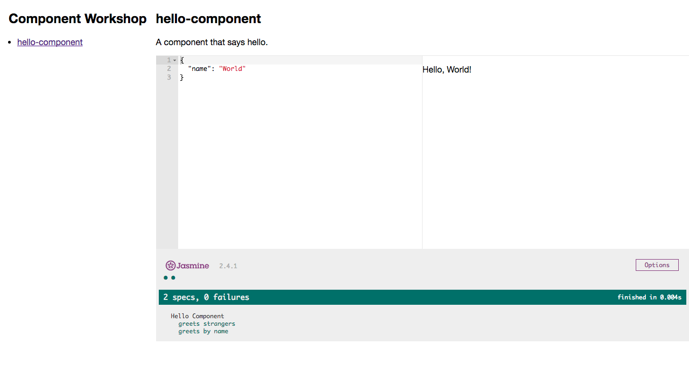

# slush-component

A [Slush](http://slushjs.github.io/#/) generator for web components.



## Introduction

Web components should be [simple](https://www.infoq.com/presentations/Simple-Made-Easy). To that end, this generator creates the following files:

* `docker-compose.yml`: A [Docker Compose](https://docs.docker.com/compose/) file that defines an instance of the [component-workshop](https://github.com/andrewshawcare/component-workshop).
* `index.js`: The component implementation.
* `package.json`: The [NPM](https://www.npmjs.com/) metadata and dependencies.
* `README.md`: Something for your users to read by candlelight in the bath.
* `spec.js`: Tests for the component.
* `test.js`: A [Jasmine](http://jasmine.github.io/2.4/introduction.html) test runner (invoked via `npm test`).

## Getting Started

1. Run the following command to install [Homebrew](http://brew.sh/):

  ```shell
  /usr/bin/ruby -e "$(curl -fsSL https://raw.githubusercontent.com/Homebrew/install/master/install)"
  ```

2. Using Homebrew, install NPM and [Docker Toolbox](https://www.docker.com/products/docker-toolbox):

  ```shell
  brew install npm docker-toolbox
  ```

3. Using NPM, install Slush and `slush-component` globally:

  ```shell
  npm install -g slush slush-component
  ```

4. Generate a component using the `slush-component` generator:

  ```shell
  slush component
  ```

5. Navigate to the directory of your web component (`hello-component` in this example):

  ```shell
  cd hello-component
  ```

6. Run the docker container container via `docker-compose`:

  ```shell
  docker-compose up
  ```
